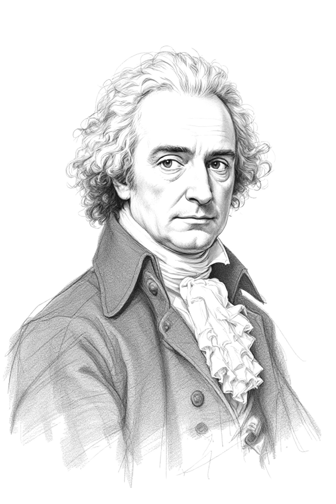
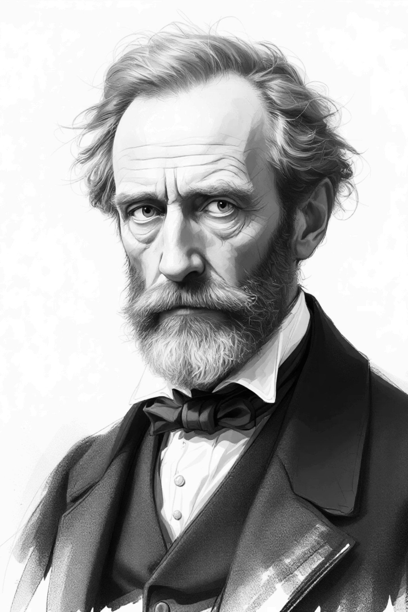
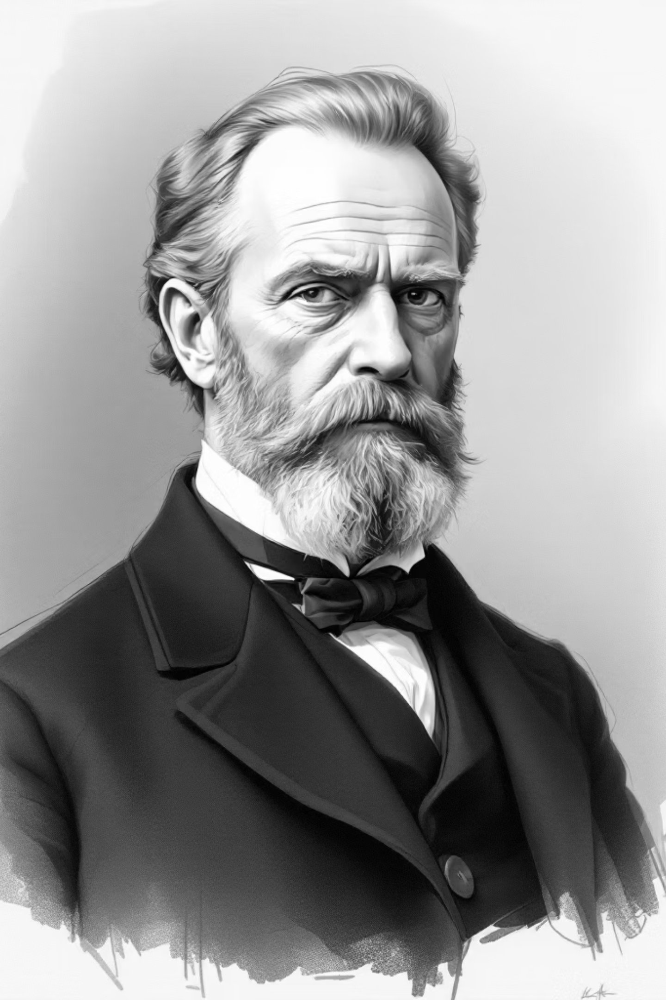

## David Hume

{.fig-right #fig-hume}

David Hume (1711–1776), no *Tratado da Natureza Humana* (1739) e na *Investigação Acerca do Entendimento Humano* (1748), sustenta que causalidade não é objeto de percepção. Sucessões repetidas de eventos A e B produzem, na mente do observador, a expectativa de que A seja a causa de B; é nesse hábito psicológico, e não num vínculo entre os eventos, que a noção de causa se constitui.


A formulação de Hume sugere que a inferência de causa se deve a:  

- contiguidade espacial e temporal,   
- precedência da causa em relação ao efeito, e   
- conjunção constante [@Morabia2013SuiGeneris]. 

A lista não inclui comparação. O sistema humeano descreve um observador diante de uma sequência de eventos, sem grupo de controle e sem perguntar o que teria acontecido se a exposição não tivesse ocorrido, pergunta hipotética que viria a organizar toda a epidemiologia contemporânea, mas que é estranha ao vocabulário de Hume [@Morabia2013SuiGeneris].

Aplicadas à clínica, as três marcas validam qualquer série de casos suficientemente longa em que pacientes expostos a determinada intervenção apresentam o desfecho de interesse. O diagnóstico humeano de causa é coerente com seus próprios termos; o diagnóstico epidemiológico exige um passo adicional, a comparação com o curso esperado na ausência da intervenção.

Hume também mostrou, no século XVIII, que o raciocínio indutivo — do tipo "B sempre seguiu A no passado, logo seguirá A no futuro" — não tem fundamento lógico. Ele identificou isso como uma limitação séria do conhecimento empírico humano: por mais vezes que A e B tenham aparecido juntos, nada na lógica garante que aparecerão juntos na próxima vez. Hume não rejeitou a indução, no entanto. Aceitou que continuamos a fazer previsões mesmo sem essa garantia, e atribuiu essa confiança a hábito mental, não a demonstração racional. O mesmo problema reaparece dois séculos depois no argumento de Savitz, Pearce e Rothman [-@Savitz2025Considerations]: a inferência causal em epidemiologia é processo indireto, que avança pela exclusão progressiva de explicações concorrentes.

## Stuart Mill

{.fig-right #fig-mill}

John Stuart Mill (1806–1873), em *A System of Logic* (1843), articula o que falta em Hume: comparação explícita entre situações. Os métodos de Mill são procedimentos para extrair inferência causal de comparações sistemáticas. Postulou 5 métodos: concordância, diferença, conjunto, resíduos, variação concomitante.

**Concordância**. Quando o fenômeno a ser explicado ocorre em situações que diferem em vários aspectos mas concordam em uma única circunstância, essa circunstância é candidata a causa. A regra opera por eliminação: se um fator está presente em todos os casos do fenômeno e todos os demais variam, ele é o candidato comum que sobra. É a lógica clássica de investigação de surto — entre os adoecidos, identifica-se o que comeram, beberam ou tocaram em comum.  

**Diferença**. Quando duas situações são idênticas exceto em uma circunstância, e o fenômeno ocorre apenas naquela em que essa circunstância está presente, a circunstância é a causa, ou parte dela. Para Mill, é o método mais robusto, porque a comparação é controlada. O ensaio clínico randomizado é a versão estatística desse método aplicada a populações: dois grupos balanceados, uma única intervenção diferente, um desfecho que se move.  

**Conjunto**. Combinação dos dois anteriores: o fenômeno aparece em situações que compartilham a circunstância candidata e está ausente em situações sem ela, ainda que as duas séries variem em outros aspectos. O método combina concordância (entre as presenças) e diferença (entre presença e ausência), reduzindo explicações alternativas que sobreviveriam a um dos dois métodos isoladamente.  

**Resíduos**. Quando uma situação produz vários efeitos e parte deles tem causas já conhecidas, o efeito que sobra é atribuível à parte da circunstância ainda não explicada. Em saúde, parte da redução pressórica observada com uma intervenção dietética é explicada pela perda de peso; o resíduo — a redução adicional não atribuível ao peso — orienta a investigação para um mecanismo independente.  

**Variação concomitante**. Quando duas circunstâncias variam juntas — uma aumenta, a outra aumenta; uma diminui, a outra diminui —, há razão para considerar que estão causalmente relacionadas, ou que ambas dependem de um terceiro fator comum. É o método que reconhece a dose-resposta como sinal informativo. Mill adverte, no entanto, que covariação não estabelece causalidade: outras configurações precisam ser eliminadas. É a antessala do problema do confundimento.

O método da diferença lembra um ensaio clínico randomizado, mas estudos epidemiológicos reais, inclusive RCTs bem conduzidos, não satisfazem esse requisito: os grupos diferem em circunstâncias particulares incontáveis [@Morabia2013SuiGeneris].

## Henle-Koch

{.fig-right #fig-koch}

Robert Koch (1843–1910), partindo de formulações de Jakob Henle, propõe no fim do século XIX critérios para estabelecer que um microrganismo é o agente causal de uma doença infecciosa específica:

1. O microrganismo deve ser encontrado em todos os indivíduos doentes e ausente nos saudáveis.
2. Deve ser isolado e cultivado em cultura pura.
3. Inoculado em hospedeiro susceptível, deve reproduzir a doença.
4. Deve ser reisolado do hospedeiro experimentalmente infectado.

A formulação postula causalidade determinística e invariável: dado o agente, temos a doença. 

Entretanto, essa concepção de microbiologia clássica é incompatível com a epidemiologia das doenças crônicas. Tabaco não produz câncer de pulmão em todos os fumantes; hipertensão não produz acidente vascular em todos os hipertensos. As causas estudadas pela epidemiologia das doenças crônicas são probabilísticas e invariantes apenas no nível populacional [@Morabia2005Causality].

## Síntese

A herança das três tradições para a epidemiologia moderna pode ser resumida em três proposições.

De Hume, causalidade não é objeto de percepção: ela é inferida. O problema da indução implica que essa inferência nunca pode ser garantida pela lógica.

De Mill, sem comparação não há inferência causal. O ideal experimental milliano antecipa a lógica do ensaio clínico randomizado, embora a exigência de comparar situações idênticas não funcione em populações reais.

De Koch, causa exige mecanismo identificável e reproduzível. A exigência funciona em microbiologia clássica, mas quebra em doenças multifatoriais, em que a relação entre exposição e desfecho é probabilística e dependente do contexto.

Schwartz, Susser e Susser [-@Schwartz1999Future] descrevem essa transição como sucessão de paradigmas: cada nova era da epidemiologia redefine o objeto da disciplina sem apagar inteiramente as intuições anteriores. A epidemiologia do século XX precisa fazer o que nenhuma das três tradições, isoladamente, autoriza: comparar populações que não são idênticas, inferir causas que não são determinísticas, e fundamentar essa inferência sem a garantia da dedução.

## Exercícios

**1.** Construa um cenário clínico em que uma série de casos satisfaça as três marcas humeanas — contiguidade, precedência, conjunção constante — sem que haja relação causal entre intervenção e desfecho (efeito placebo). Identifique o elemento metodológico, ausente da formulação de Hume, que distingue uma série de casos de um RCT.

**2.** Em um centro de cardiologia, todos os pacientes que receberam um novo dispositivo de monitorização remota apresentaram melhora dos sintomas de insuficiência cardíaca em três meses. O cardiologista conclui que o dispositivo funciona. Aplicando o método da diferença de Mill com rigor, que dado falta para essa conclusão ser defensável? Por que a aplicação literal dos postulados de Koch a esse tipo de pergunta é incoerente?

**3.** Em Morabia [-@Morabia2013SuiGeneris], identifique passagens em que o autor sustenta que o sistema de Hume e o método de Mill, isoladamente, não autorizam o tipo de inferência observacional que a epidemiologia contemporânea pratica. Em uma frase para cada filósofo, explique por que sua tradição, sozinha, não dá conta dessa tarefa.

```{=html}
<nav class="chapter-nav" aria-label="Navegação entre capítulos">
  <span class="chapter-nav-spacer"></span>
  <span class="chapter-nav-meta">Capítulo 1 de 5</span>
  <a class="chapter-nav-next" href="02-virada-seculo-xx.html">
    <span><span class="chapter-nav-label">Próximo</span><span class="chapter-nav-title">A virada do século XX</span></span>
    <span aria-hidden="true">→</span>
  </a>
</nav>
```
