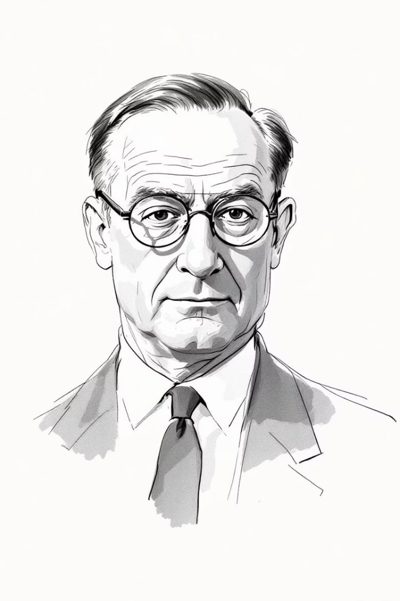
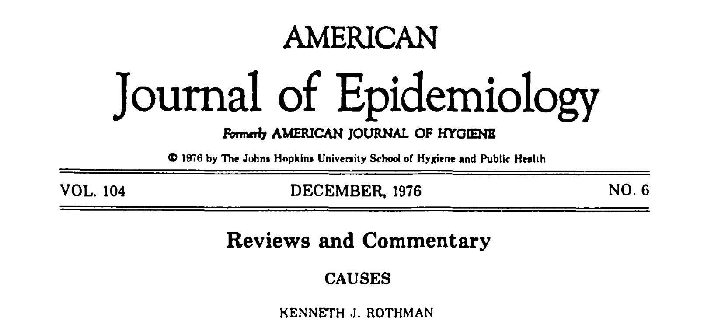
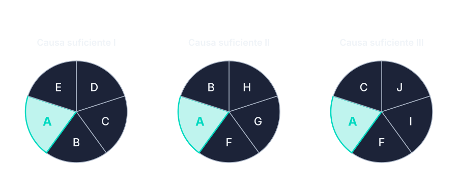
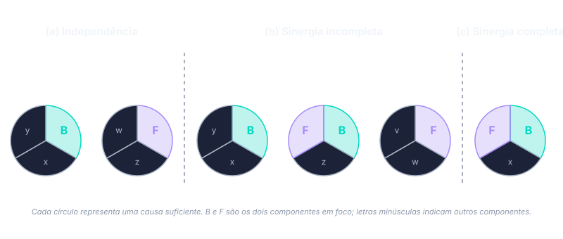

A epidemiologia da segunda metade do século XX enfrenta um objeto que os postulados de Henle-Koch não cobrem: doenças crônicas, multifatoriais, sem agente único e sem causalidade determinística. O caso paradigmático é tabaco e câncer de pulmão. Não há "germe do câncer de pulmão" no sentido kochiano; nem todos os fumantes desenvolvem a doença; entre os que desenvolvem, alguns nunca fumaram.

Morabia [-@Morabia2005Causality] sustenta que essa diferença é estrutural, não temporária. As causas estudadas pela epidemiologia das doenças crônicas são invariantes apenas no nível populacional, não no nível do indivíduo. Postulados desenhados para causação determinística — onde dada presença do agente, dada a doença — produzem erro categorial quando aplicados a relações como tabaco-câncer. A exigência de identificação de agente específico, central em Koch, deixa de ser método e passa a ser obstáculo.

Schwartz, Susser e Susser [-@Schwartz1999Future] organizam essa transição em uma sucessão de paradigmas: 

1. Estatística sanitária do século XIX (sem teoria de mecanismo), era bacteriológica fundada nos postulados de Henle-Koch (causalidade determinística pareada com mecanismo identificado), 
2. Epidemiologia das doenças crônicas estruturada em torno do conceito de fator de risco probabilístico
3. Propostas contemporâneas de pensar causa em múltiplos níveis (gene, indivíduo, comunidade, contexto histórico). 

Cada paradigma redefine o que conta como causa e arrasta consigo intuições do anterior.

## O Surgeon General Report e a palestra de Hill

{.fig-right #fig-hill}


Em janeiro de 1964, o relatório do U.S. Surgeon General — *Smoking and Health: Report of the Advisory Committee to the Surgeon General of the Public Health Service* [-@SurgeonGeneral1964Smoking] — apresenta o primeiro pronunciamento oficial federal afirmando que tabagismo é causa de câncer de pulmão. O documento se sustenta em literatura observacional e laboratorial; nenhum ensaio clínico randomizado existia ou poderia ser conduzido. A conclusão sofreu objeções metodológicas respeitáveis, a mais conhecida sustentando que confundimento por traços genéticos comuns à propensão a fumar e a desenvolver câncer poderia explicar a associação observada. A objeção era logicamente válida e exigia resposta sistemática.

Em 1965, Austin Bradford Hill profere palestra na Royal Society of Medicine, intitulada "The Environment and Disease: Association or Causation?" [@Hill1965Environment]. Hill participara, nas décadas anteriores, de investigações empíricas centrais sobre a relação tabaco-câncer; a palestra codifica princípios que vinham orientando essa prática. O texto é breve, escrito em prosa direta, e estabelece um vocabulário que persiste até hoje. Hill apresenta nove pontos de vista — *viewpoints*, em seu próprio termo — para auxiliar a decisão sobre se uma associação observacional reflete relação causal. Não os apresenta como critérios a serem somados.

## Os nove pontos de vista

A advertência inicial de Hill é explícita: nenhum dos nove é, isoladamente, condição suficiente para inferir causa, e apenas a temporalidade é estritamente necessária. Os pontos auxiliam o exame da evidência; nenhum o resolve.

**1. Força.** Magnitude do efeito. Hill argumenta que associações fortes são mais difíceis de atribuir a vieses ou confundimento residual, e ilustra com a razão de mortalidade por câncer de pulmão entre fumantes pesados e não-fumantes — da ordem de vinte para um. Adverte, porém, que efeitos pequenos podem ser causais.

**2. Consistência.** A associação reaparece entre populações, observadores, desenhos de estudo e contextos diferentes. Replicação reduz a probabilidade de o achado ser artefato de uma amostra ou método particular.

**3. Especificidade.** Uma causa produz um efeito específico, não múltiplos. Hill apresenta o ponto com reservas: muitas associações causais reais não satisfazem especificidade — o tabaco causa câncer de pulmão, doença cardiovascular, DPOC e outros cânceres.

**4. Temporalidade.** A causa precede o efeito. Para Hill, é a única condição com status especial: sem temporalidade, a inferência causal sequer pode ser formulada.

**5. Gradiente biológico.** Relação dose-resposta. Aumenta a plausibilidade da interpretação causal — quanto mais exposição, mais desfecho.

**6. Plausibilidade.** Compatibilidade com o conhecimento biológico ou mecanístico do período. Hill alerta que plausibilidade é contingente: o que parece implausível agora pode tornar-se plausível com nova evidência mecanística, e vice-versa.

**7. Coerência.** A interpretação causal não conflita com o conhecimento estabelecido sobre a história natural e a biologia da doença. Próximo de plausibilidade, mas operando no plano descritivo (compatibilidade entre fatos) em vez do plano explicativo (mecanismo).

**8. Evidência experimental.** Manipular a exposição e observar mudança correspondente no desfecho. Para Hill, o argumento mais forte. Em saúde pública, intervenções controladas são frequentemente impossíveis por motivos éticos ou logísticos; quase-experimentos cumprem parte do papel.

**9. Analogia.** Paralelo com situação causal já estabelecida. Hill apresenta este ponto como o mais fraco — analogia justifica suspeita, raramente sustenta inferência.

A conclusão da palestra retoma a advertência inicial: a tarefa do epidemiologista não é provar causalidade no sentido dedutivo, e sim avaliar se a explicação causal é mais provável que as alternativas concorrentes — acaso, viés, confundimento, causalidade reversa. Os nove pontos auxiliam essa avaliação; nenhum a resolve.

## Rothman e a causa suficiente

{.fig-right #fig-rothman-paper}

Onze anos depois, em texto curto publicado no *American Journal of Epidemiology* [@Rothman1976Causes], Kenneth Rothman propõe modelo formal que organiza a noção multifatorial de causa: o **modelo de causa suficiente** (*sufficient component cause model*), também conhecido como modelo dos *causal pies*.

{#fig-rothman-pies}


Três definições estruturam o modelo.

**Causa necessária** é um componente que aparece em todas as causas suficientes para o desfecho. Sem ela, a doença não ocorre, qualquer que seja a combinação dos demais fatores. O exemplo canônico é o HPV em câncer de colo uterino.

**Causa suficiente** é um conjunto de fatores que, quando todos presentes simultaneamente, produzem o desfecho de modo invariável. Cada conjunto pode ser representado como uma "torta causal" — daí o apelido informal.

**Componente** é cada fator dentro de uma causa suficiente. A torta inteira produz a doença; o componente isolado, em geral, não.

A doença pode ter múltiplas causas suficientes (várias tortas distintas, cada qual capaz de produzir o desfecho); um mesmo fator pode aparecer como componente de uma, de várias, ou de todas as causas suficientes (caso da causa necessária).

A implicação imediata, que reorganiza silenciosamente a interpretação de Hill, é a seguinte: a "força" de uma associação não é propriedade intrínseca da causa. Depende da prevalência dos demais componentes na população estudada. Em uma população onde os outros componentes da torta são raros, o efeito do componente em questão será forte; onde são comuns, será fraco. A mesma relação biológica pode produzir associações epidemiológicas de magnitudes distintas em populações distintas — não por ser mais ou menos causal, mas por interagir com a distribuição populacional dos cofatores. Suzuki e Yamamoto [-@Suzuki2021Strength] elaboram formalmente essa relação entre força de associação e composição populacional, mostrando como o modelo de causa suficiente articula o que estava implícito em Hill.

### Sinergia e modificação de efeito

Dois componentes são **sinérgicos** quando aparecem juntos em uma mesma causa suficiente. Na linguagem de Rothman, sinergia equivale ao que outras tradições epidemiológicas chamam de **modificação de efeito** ou **interação positiva**: dois fatores que, juntos, produzem um efeito maior do que a soma dos efeitos isolados de cada um.

Considere dois componentes B e F. Três configurações possíveis das causas suficientes que os contêm.

**(a) Independência.** B e F nunca aparecem juntos. Cada um contribui para a doença através de uma causa suficiente diferente. A presença simultânea dos dois produz apenas a soma dos efeitos isolados — não há ganho adicional pela combinação.

**(b) Sinergia incompleta.** B e F aparecem juntos em uma causa suficiente, e cada um também aparece — sozinho, com outros componentes — em outras causas suficientes. Cada fator tem efeito independente, e o efeito combinado excede a soma. Exemplo clínico: álcool e tabaco em câncer de boca e faringe. Cada fator isolado eleva o risco; juntos, o risco excede a soma das contribuições isoladas.

**(c) Sinergia completa.** B e F só atuam quando juntos. Nenhum dos dois aparece em qualquer outra causa suficiente. Sem o outro, nenhum tem efeito. Exemplo: gene da fenilcetonúria (PKU) e fenilalanina na dieta. A doença só ocorre quando o indivíduo tem o gene **e** consome fenilalanina; nenhum dos dois fatores produz a doença sozinho.

{#fig-sinergia}

Causas necessárias têm relação particular com a sinergia: por construção, são **parcialmente sinérgicas com todas as outras causas** do mesmo desfecho. Como uma causa necessária é membro de toda causa suficiente, ela atua sempre em combinação com outros componentes. HPV, em câncer de colo uterino, é parcialmente sinérgico com cada outro componente de cada causa suficiente para esse câncer.

A sinergia, como a força de associação, depende da composição da população. Em uma população onde os componentes que tornariam B e F separadamente eficazes estão ausentes, a sinergia entre eles aparece como completa. Em outra população onde esses componentes são frequentes, a mesma relação biológica aparece como incompleta. O conceito descreve um padrão observado, não uma estrutura biológica fixa.

### Fração etiológica

A fração etiológica de um componente é a parcela de casos da doença atribuível às causas suficientes que o contêm. A soma dessas frações pode exceder 100%, porque cada caso é atribuído a cada componente da causa suficiente que o produziu — em câncer de boca, álcool e tabaco têm cada um fração etiológica acima de 50% [@Rothman1976Causes].

Implicação prática: bloquear um único componente elimina todos os casos da causa suficiente que o contém.

## Síntese

Hill e Rothman fazem a primeira refundação conceitual da causalidade em epidemiologia. Hill dá o vocabulário operacional para evidência observacional; Rothman dá a estrutura formal que mostra por que essa tarefa é possível sem a invariabilidade exigida em microbiologia. 

Dois problemas ficam abertos: como definir com rigor o que teria acontecido se a exposição não tivesse ocorrido, e como escolher o ajuste estatístico correto quando as variáveis se influenciam mutuamente. O Cap. 03 trata dessas duas questões.


## Exercícios

**1.** Para a relação tabagismo-câncer de pulmão, identifique quais dos nove pontos de Hill são satisfeitos com facilidade e quais exigem cuidado interpretativo. Aplique especificamente o ponto da especificidade: o tabaco satisfaz especificidade? Justifique.

**2.** No modelo de causa suficiente de Rothman, considere uma doença com duas causas suficientes — a primeira composta dos componentes A, B e C; a segunda composta dos componentes A, D e E. Quem é a causa necessária? O que acontece com a magnitude da associação entre B e a doença se a prevalência de A no grupo exposto for muito baixa? Esboce a resposta usando os *pies*.

**3.** Hill afirma que apenas a temporalidade é, em sentido estrito, condição necessária para inferência causal. Construa um cenário hipotético em que todos os outros oito pontos pareçam satisfeitos, mas a temporalidade esteja em dúvida — e mostre como essa dúvida basta para suspender a conclusão causal.

```{=html}
<nav class="chapter-nav" aria-label="Navegação entre capítulos">
  <a class="chapter-nav-prev" href="01-antes-epidemiologia.html">
    <span aria-hidden="true">←</span>
    <span><span class="chapter-nav-label">Anterior</span><span class="chapter-nav-title">Antes da epidemiologia</span></span>
  </a>
  <span class="chapter-nav-meta">Capítulo 2 de 5</span>
  <a class="chapter-nav-next" href="03-formalizacao-causal.html">
    <span><span class="chapter-nav-label">Próximo</span><span class="chapter-nav-title">A formalização da inferência causal</span></span>
    <span aria-hidden="true">→</span>
  </a>
</nav>
```
