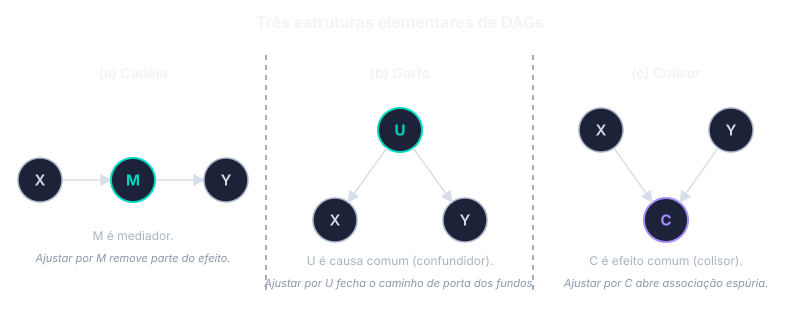

Hill e Rothman deram à epidemiologia um vocabulário operacional para inferência a partir de dados observacionais, mas não formalizaram o que significa, com rigor, "X causa Y". Duas perguntas permaneciam fora do alcance da formulação clássica: qual é o conteúdo preciso de uma afirmação causal, e sob que condições dados observacionais permitem identificá-la. A resposta a essas perguntas, construída entre meados dos anos 1980 e os anos 2010, refundou a disciplina em torno de uma linguagem precisa de **resultados potenciais** e **grafos causais**.

## Resultados potenciais

A ideia central é simples. Imagine que cada paciente, antes de receber qualquer tratamento, tem **dois desfechos possíveis**: o que aconteceria se tomasse o medicamento, e o que aconteceria se não tomasse. O efeito do medicamento para aquele paciente é a diferença entre esses dois desfechos. A literatura chama esses dois desfechos hipotéticos de **resultados potenciais**.

Há um problema fundamental. Na vida real, cada paciente só vive **uma** das duas histórias. Quem tomou o medicamento não viveu a história de não-tomar; quem não tomou não viveu a história de tomar. O desfecho que teria acontecido sob o tratamento alternativo permanece como cenário hipotético, impossível de medir naquele mesmo indivíduo.

A consequência é incômoda mas estrutural: o efeito do tratamento em um indivíduo específico **nunca pode ser observado diretamente**. O que dá para estimar, sob condições que veremos a seguir, é o efeito **médio na população**: pacientes que tomaram o medicamento tiveram desfechos, em média, quão diferentes dos pacientes que não tomaram?

A pergunta epidemiológica passa a ser: quando dados observacionais permitem estimar esse efeito médio?

## Três condições para estimar o efeito causal

Sob três condições, o efeito médio do tratamento é estimável a partir de dados observacionais. Nenhuma das três é uma propriedade dos dados — são todas suposições sobre a estrutura do problema, e nenhuma pode ser confirmada por teste estatístico. A justificativa para cada uma vem de conhecimento clínico e biológico, não dos números.

**Permutabilidade.** Os grupos comparados precisam ser, em média, comparáveis antes do tratamento. Se o grupo que tomou estatina é mais jovem, mais magro, com melhor perfil lipídico e mais ativo do que o grupo que não tomou, os dois grupos não são comparáveis: a diferença que se observa em mortalidade pode estar contando o efeito desses outros fatores em vez do efeito da estatina.

Em ensaios clínicos, a randomização garante essa comparabilidade — a moeda decide quem recebe o tratamento, e em média os dois grupos ficam parecidos em tudo, inclusive nos fatores que ninguém mediu. Em estudos observacionais, a comparabilidade exige medir todos os fatores que diferem entre os grupos *e* afetam o desfecho, e depois ajustar a análise por eles. A dificuldade é justamente identificar quais fatores são esses — pergunta que não tem resposta nos dados, só no conhecimento substantivo do problema.

**Positividade.** Em cada subgrupo de pacientes, precisa haver tanto pessoas que receberam o tratamento quanto pessoas que não receberam. Se todos os pacientes acima de 80 anos receberam o medicamento e nenhum deixou de receber, não há comparação possível para esse subgrupo — não há controle naquela faixa etária. O efeito do medicamento em pacientes acima de 80 anos não é identificável a partir dos dados, por mais sofisticada que seja a análise.

**Consistência.** O tratamento estudado precisa ser bem definido. Se "tomou o medicamento" inclui pacientes em dose plena, em dose reduzida, com formulações diferentes e com regimes de aderência variados, então não há *um* tratamento sendo estudado — há vários. O desfecho de cada paciente corresponde à versão específica que ele tomou; somar tudo como se fosse um único tratamento mistura efeitos potencialmente distintos.

Greenland e Robins [-@Greenland1986Identifiability] foram dos primeiros a articular essas exigências em forma sistemática. A leitura contemporânea é direta: nenhuma análise estatística de dados observacionais pode estimar o efeito causal sem que as três condições sejam plausíveis. A análise é tão boa quanto a defesa que se faz das três suposições.

## Confundimento como problema de identificação

Greenland e Robins [-@Greenland1986Identifiability] reformularam o conceito de confundimento à luz dessa estrutura. Confundimento, na linguagem dos resultados potenciais, é exatamente a falha da permutabilidade entre os grupos comparados: expostos e não expostos diferem, antes da exposição, em fatores que afetam o desfecho. Um confundidor é, então, uma variável cujo ajuste restaura a permutabilidade condicional.

A reformulação resolve uma ambiguidade da definição clássica baseada em "associado à exposição e ao desfecho, e não na via causal". A definição clássica não distingue, com rigor, entre confundidores legítimos, variáveis intermediárias (mediadores) e consequência comum de exposição e desfecho (colliders) — categorias que demandam tratamento estatístico oposto. A definição em termos de resultados potenciais resolve essa ambiguidade.

## Grafos acíclicos direcionados

Para representar visualmente as estruturas causais que sustentam essas inferências, a literatura passou a usar **grafos acíclicos direcionados** (DAGs). Os nós representam variáveis; as setas representam efeitos causais diretos. "Acíclicos" significa que nenhuma sequência de setas retorna a um nó já visitado — não há causalidade circular instantânea.

Duas propriedades organizam o uso de DAGs em pesquisa clínica. A seta codifica direção causal hipotetizada sem especificar forma funcional: $X \rightarrow Y$ significa que $X$ pode afetar $Y$, mas não distingue relação linear, quadrática ou logarítmica. A *ausência* de seta carrega a informação principal — afirma que, na estrutura proposta, não existe efeito causal direto entre os nós correspondentes. Construir um DAG é, portanto, exercício de explicitar o conhecimento substantivo sobre o problema antes da análise estatística. Byeon e Lee [-@Byeon2023DAGs] sistematizam o uso desses grafos em pesquisa clínica e cirúrgica, com ênfase nas armadilhas que decorrem de ignorar a estrutura causal.

### Três estruturas elementares

{#fig-dag-estruturas}

**Cadeia.** $X \rightarrow M \rightarrow Y$. A variável $M$ é mediador: parte do efeito causal de $X$ sobre $Y$ passa por $M$. Ajustar por um mediador remove parte do efeito causal de interesse — um erro que a definição clássica de confundidor pode induzir.

**Garfo.** $X \leftarrow U \rightarrow Y$. A variável $U$ é causa comum (confundidor) de $X$ e $Y$ e abre um "caminho de porta dos fundos" (*backdoor path*) que produz associação não causal entre $X$ e $Y$. Ajustar por $U$ fecha esse caminho e identifica o efeito causal.

**Colisor.** $X \rightarrow C \leftarrow Y$. A variável $C$ é consequência comum de $X$ e $Y$. Em sua forma não condicionada, o colisor não produz associação espúria entre $X$ e $Y$. Ajustar por $C$ — selecionar a amostra com base nele, estratificar — abre uma associação que não existia. O fenômeno é conhecido pelo menos desde Berkson em contexto hospitalar; o vocabulário gráfico permite reconhecê-lo sistematicamente em estruturas mais complexas.

### A regra geral: d-separação e porta dos fundos

A regra que generaliza essas três configurações é a **d-separação** [-@Byeon2023DAGs]. Um caminho entre dois nós em um DAG está bloqueado quando: (a) contém uma cadeia ou um garfo cujo nó intermediário foi ajustado; (b) contém um colisor cujo nó central — e nenhum de seus descendentes — foi ajustado. Dois nós são d-separados quando todo caminho entre eles está bloqueado; sob d-separação, são condicionalmente independentes.

A aplicação direta da regra ao problema do confundimento é o **critério de porta dos fundos**: para identificar o efeito causal de $X$ sobre $Y$, encontre um conjunto $Z$ que (a) bloqueie todo caminho que entra em $X$ por trás (backdoor) e (b) não contenha descendentes de $X$ — ou seja, não introduza colisores. Atendido o critério, o ajuste estatístico por $Z$ recupera o efeito causal médio. Em DAGs com muitas variáveis, o conjunto $Z$ que satisfaz o critério não é único, e ferramentas como o DAGitty [-@Byeon2023DAGs] enumeram os **conjuntos mínimos de ajuste suficiente** a partir do grafo.

### Viés-M e seleção por significância estatística

A intuição tradicional de "ajustar por toda variável associada à exposição e ao desfecho" é incompatível com o aparato gráfico. A configuração mais ilustrativa é o **viés-M** (*M-bias*), em que ajustar por uma variável associada simultaneamente a exposição e desfecho introduz, em vez de reduzir, viés.

{#fig-dag-mbias}

Considere o cenário clínico apresentado por Byeon e Lee [-@Byeon2023DAGs]. Estuda-se a associação entre uso de inibidor seletivo de recaptação de serotonina (ISRS) e câncer de pulmão. Depressão (DEP) causa o uso de ISRS e, por mecanismos comportamentais ou inflamatórios, doença arterial coronariana (DAC). Tabagismo (TAB) causa DAC e câncer de pulmão. Na estrutura proposta, não há efeito direto de ISRS sobre câncer de pulmão. DAC é descendente comum de DEP e TAB — colisor.

Sob a estratégia tradicional baseada em significância estatística, DAC seria identificada como confundidora — está associada a ISRS (porque DEP causa ambos) e a câncer de pulmão (porque TAB causa ambos) — e incluída no ajuste. Esse ajuste abre o caminho ISRS ← DEP → DAC ← TAB → câncer de pulmão e cria associação espúria entre ISRS e câncer de pulmão em uma estrutura na qual o efeito real é zero. As simulações relatadas por Byeon e Lee [-@Byeon2023DAGs] mostram que o viés introduzido pode ser substancial, e que a estratégia inversa — não ajustar por DAC — recupera a estimativa correta.

A lição é que a seleção de covariáveis com base em significância estatística, sem inspeção da estrutura causal, pode produzir vieses que a intuição clássica não apenas falha em prevenir como ativamente cria. Como alternativa principista, Byeon e Lee [-@Byeon2023DAGs] retomam o **critério de causa disjuntiva**: ajustar por toda variável que cause exposição, desfecho, ou ambos, excluindo (a) variáveis instrumentais que afetem apenas a exposição e (b) descendentes da exposição. O critério é mais conservador que o critério de porta dos fundos, mas dispensa especificação completa do DAG e protege contra a inclusão acidental de colisores no conjunto de ajuste.

### Limitações dos DAGs

Três limitações estruturais merecem registro [-@Byeon2023DAGs]. Primeiro, DAGs não contêm informação sobre **forma funcional**: identificada a estrutura causal e selecionado o conjunto de ajuste, persiste a tarefa de especificar o modelo regressivo (linear, polinomial, *splines*, modelos de aprendizado de máquina). Segundo, DAGs não quantificam a **magnitude do viés** — apenas indicam sua presença e direção sob a estrutura proposta; estimativas quantitativas exigem análise de viés dedicada (Cap. 04). Terceiro, em problemas com muitas variáveis, a **direção das setas** pode ser ambígua mesmo com base no conhecimento substantivo, e diferentes DAGs plausíveis podem coexistir para o mesmo problema. O critério de causa disjuntiva e a comparação entre conjuntos de ajuste alternativos atenuam, sem eliminar, esse problema.

## A direção do viés

Estabelecer a estrutura causal é uma coisa; saber, na presença de confundidores não medidos, em que direção o viés residual atua é outra. VanderWeele, Hernán e Robins [-@VanderWeele2008Direction] estendem o aparato gráfico para tratar esse problema. O artigo introduz arestas com sinal — positivo ou negativo — e estabelece condições sob as quais é possível inferir, a partir das relações de monotonicidade entre exposição, desfecho e confundidor, se um confundidor não medido produz **viés positivo** (a associação observada superestima o efeito) ou **viés negativo** (a associação observada subestima ou inverte o efeito).

A aplicação clínica imediata aparece nos casos paradigmáticos do site. O "viés do usuário saudável" (*healthy-user bias*) — segundo o qual indivíduos que aderem a hábitos preventivos de saúde, inclusive medicações, tendem a praticar outros hábitos protetores não medidos — produz, sistematicamente, viés positivo em associações entre tratamento e desfechos saudáveis. É a mecânica que sustentou décadas de evidência observacional favorável à terapia de reposição hormonal e a suplementos vitamínicos antes que ensaios randomizados a invertessem.

## O target trial

A última peça do aparato é o **target trial**, formalizado por Hernán e Robins [-@Hernan2016TargetTrial]: o ensaio clínico hipotético que o pesquisador estaria conduzindo, se conseguisse. A formulação se desdobra em uma exigência de protocolo — critérios de elegibilidade, estratégias de tratamento explicitamente definidas, momento de início (o "zero do tempo"), procedimento de atribuição, seguimento, desfecho, análise estatística. Especificado o protocolo, a análise observacional é avaliada pelo grau em que o emula. Discrepâncias entre os dois revelam fontes específicas de viés — entre as quais a mais frequente é o viés de tempo imortal, em que o desenho compara pacientes "tratados" com pacientes que tiveram, na prática, o privilégio de sobreviver até o início do tratamento.

A noção tem efeito disciplinar imediato. Muitos estudos observacionais de comparação entre tratamentos, ao serem traduzidos em protocolo de target trial, revelam-se a emular ensaios com desenhos absurdos ou impossíveis. Reescrever o protocolo até que ele seja sensato força a análise a abandonar comparações que não admitem interpretação causal.

## Síntese

Resultados potenciais, DAGs e target trial constituem o vocabulário comum da inferência causal contemporânea em epidemiologia. Os três aparatos não substituem Hill e Rothman; tornam preciso o que aqueles deixavam intuitivo. Causa, na leitura contemporânea, é diferença entre resultados potenciais. Confundimento é não-permutabilidade. Ajuste estatístico é a aplicação do critério de porta dos fundos. Evidência experimental, a prova mais forte segundo Hill, ganha contraparte observacional precisa: emular um target trial.

Revisões recentes [@Shimonovich2021Assessing; @Lesko2025Evolved] retomam explicitamente os nove pontos de Hill à luz desse vocabulário, mostrando que o aparato moderno preserva o que era operacional em Hill e fundamenta o que era informal. Suzuki e Yamamoto [-@Suzuki2021Strength] fazem o mesmo para o modelo de causa suficiente de Rothman, articulando a relação entre causa suficiente e resultado potencial. A continuidade conceitual é maior do que sugere o salto vocabular.

O Cap. 04 mostra como esse aparato vira ferramenta clínica no problema central da epidemiologia observacional: o controle do confundimento, com atenção à direção do viés.

## Exercícios

**1.** O efeito do tratamento em um indivíduo específico não pode ser observado diretamente. Construa um argumento de até cinco linhas explicando por quê — mesmo que se conheça o desfecho de todos os pacientes da amostra. Qual é, então, a quantidade que pode ser estimada a partir de dados observacionais, e quais condições essa estimação exige?

**2.** Desenhe o DAG para a relação entre hipertensão arterial (X) e mortalidade (Y), incluindo: idade (A) como confundidor, níveis séricos de creatinina (M) como mediador potencial, e admissão hospitalar no período do estudo (C) como possível consequência comum de exposição e desfecho. Identifique os caminhos de porta dos fundos. Indique sob quais ajustes a associação observada estima o efeito causal de hipertensão sobre mortalidade — e quais ajustes introduzem viés.

**3.** Especifique o protocolo de um target trial para a pergunta: "metformina, em pacientes com diabetes tipo 2 sem doença cardiovascular estabelecida, reduz mortalidade por causas cardiovasculares?". Liste, em uma frase cada: critérios de elegibilidade, estratégias de tratamento comparadas, zero do tempo, procedimento de atribuição (no trial hipotético), seguimento, desfecho primário, tipo de estimando da análise. Em seguida, identifique uma análise observacional que falharia em emular esse target trial e o tipo de viés que isso introduziria.

```{=html}
<nav class="chapter-nav" aria-label="Navegação entre capítulos">
  <a class="chapter-nav-prev" href="02-virada-seculo-xx.html">
    <span aria-hidden="true">←</span>
    <span><span class="chapter-nav-label">Anterior</span><span class="chapter-nav-title">A virada do século XX</span></span>
  </a>
  <span class="chapter-nav-meta">Capítulo 3 de 5</span>
  <a class="chapter-nav-next" href="04-confundimento.html">
    <span><span class="chapter-nav-label">Próximo</span><span class="chapter-nav-title">Confundimento na lente moderna</span></span>
    <span aria-hidden="true">→</span>
  </a>
</nav>
```
